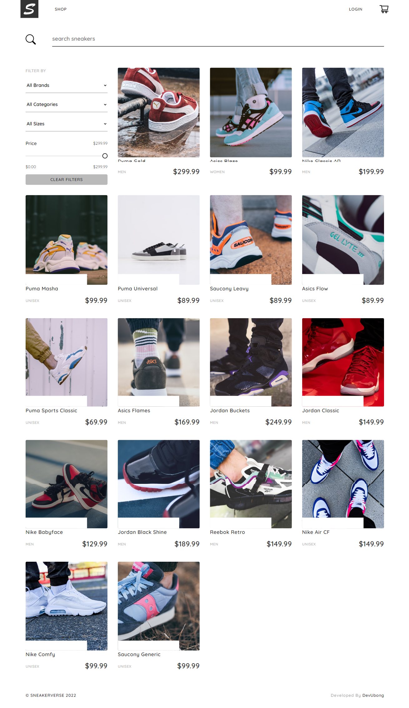

# Sneakerverse Ecommerce Website

Live Link [Sneakerverse](https://sneakerverse.netlify.app/)

This project was bootstrapped with [Create React App](https://github.com/facebook/create-react-app).

## Design Inspiration

I built this app based on design inspiration with some variations

[All design inspiration images](https://github.com/ubong-s/sneakerverse-react/tree/main/design)

## About this project

-  The challenge is to build out a functioning ecommere website.
-  `useContext and `useReducer` hooks are used for state management.
-  Stripe is integrated
-  DatoCMS is used for content management
-  Auth for user management

## The challenge

Users should be able to:

-  View the optimal layout for the app depending on their device's screen size
-  See hover states for all interactive elements on the page
-  View Products
-  Filter all products by name search, brands, category, size or price
-  View each product page
-  Add product to cart
-  Remove product from cart
-  Increase product quantity in product page without exceeding the available stock
-  Increase product quantity in cart page without exceeding the available stock
-  Login and Logout
-  Cannot checkout unless logged in
-  Proccess payment using checkout (Test Checkout)

## How to navigate this project

-  State management using `useContext`[Code](https://github.com/ubong-s/sneakerverse-react/tree/main/src/context) and `useReducer`[Code](https://github.com/ubong-s/sneakerverse-react/tree/main/src/reducers) hooks.
-  Responsive CSS using styled-components [Code](https://github.com/ubong-s/sneakerverse-react/blob/main/src/styles/globalStyle.js)
-  This application fetches products data from the [DatoCMS](https://www.datocms.com/) using graphql
-  Stripe is integrated [Code](https://github.com/ubong-s/sneakerverse-react/blob/main/src/components/StripeCheckout.js)

## Improvements that can be made

-  Use a project management too to manage processes
-  Incorporate a testing library
-  Add filter by colors
